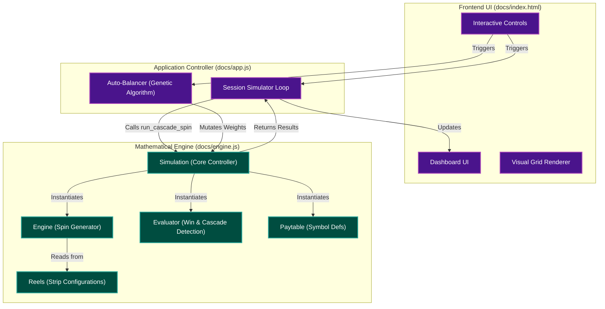

<div align="center">

# Slot Game Simulation Engine

**Production-grade Monte Carlo slot math engine — RTP, volatility, and win distribution at millions of spins per second.**

[](https://python.org)
[](#testing)
[](#license)
[](#parallel-execution)
[](docs/index.html)
[](https://slot-simulation-engine.onrender.com)

</div>

---

## What This Is

A full-stack slot game math toolkit — Python simulation engine on the backend, interactive browser UI on the frontend. Models the same mechanics used in commercial casino titles: 20-line payline evaluation, free-spins with retrigger, and Dragon Link–style Hold & Spin with a four-tier jackpot system.

Built for math designers who need numbers fast, not stories.

---

## Features

| | |
|---|---|
| 🎲 **Monte Carlo runner** | 10M+ spins with Welford online variance (numerically stable) |
| ⚡ **Parallel execution** | `multiprocessing.Pool` — near-linear scaling across cores |
| 🌱 **Reproducible runs** | Seeded RNG with deterministic per-worker seed derivation |
| 📊 **RTP decomposition** | Base / Bonus / Hold & Spin contributions tracked independently |
| 📉 **95% Confidence Interval** | `±1.96 × σ / √n` on RTP displayed live after every run |
| 🔍 **Win evaluation** | Lines (20-payline) and Ways (243) evaluators, wild substitution |
| 🎰 **Free Spins** | Scatter-triggered, configurable multiplier, retrigger cap |
| 🔒 **Hold & Spin** | Reel-weight coin probability, 3 lives, Grand jackpot on full screen |
| 🎯 **RTP Tuner** | Binary search converges wild weight to any target RTP |
| 🌐 **Web simulator** | In-browser Monte Carlo — no server needed |
| 🐍 **Python API backend** | FastAPI on Render — swap engine via toggle, results cached |
| 💾 **Simulation history** | Last 10 runs stored in `localStorage`; one-click re-run |
| 🔗 **Share URL** | Encode full config into a URL hash; anyone with the link loads it instantly |
| 🧬 **Genetic auto-balancer** | Evolve symbol weights toward a target RTP using crossover + mutation |
| 🔐 **Security hardened** | CORS restriction, per-IP rate limiting, Pydantic input bounds, XSS-safe DOM |
| ✅ **46 unit + integration tests** | Full coverage including end-to-end `SimulationRunner` pipeline |

---

## Project Layout

```
slot-simulation-engine/
├── main.py              Entry point + build_game() factory
├── paytable.py          Symbol definitions and payout tables
├── reels.py             Weighted reel strips and grid generation
├── evaluator.py         Win evaluation — LinesEvaluator, WaysEvaluator
├── bonus.py             Free-spins feature with retrigger cap
├── hold_and_spin.py     Hold & Spin — jackpots, reel-accurate respins
├── simulation.py        Monte Carlo runner — stats, CI, balance history, CSV export
├── server.py            FastAPI backend — simulate + tune endpoints, result cache
├── tuner.py             Binary-search wild weight to target RTP
├── visualize.py         Matplotlib charts from results.csv
├── tests.py             46 unit + integration tests
├── requirements.txt     FastAPI + uvicorn
├── render.yaml          Render.com deployment config
└── docs/
    ├── index.html       Web simulator UI
    ├── balancer.html    Genetic auto-balancer studio
    ├── engine.js        JS port of the math engine (cascade, H&S, free spins)
    ├── simulation.worker.js  Web Worker wrapper
    ├── balancer.js      Genetic algorithm — crossover, mutation, fitness eval
    └── app.js           UI controller — history, share URL, CI display, backend toggle
```

### Architecture Graph



---

## Quick Start

**Prerequisites:** Python 3.9+, no external dependencies for the core engine.

```bash
# Clone
git clone https://github.com/Doublew08/slot-simulation-engine.git
cd slot-simulation-engine

# Optional: charts
pip install matplotlib
```

```bash
# Run 1M spins (default)
python main.py

# Custom spin count + reproducible seed
python main.py 5000000 42

# Parallel — 4 worker processes
python main.py 10000000 42 4

# Tune wild weight to exactly 95% RTP
python tuner.py 0.95

# Visualize the last run
python visualize.py

# Run all tests
python tests.py
```

**Web UI** — open `docs/index.html` in any browser. No server required.

**Python API** — run locally or use the hosted Render deployment:

```bash
pip install fastapi "uvicorn[standard]"
python server.py
# → http://localhost:8000
```

---

## Sample Output

```
Starting: 10,000,000 spins | bet=1.0 | seed=42 | workers=4

--- Simulation Results ---
  Total RTP:                        94.8231%
  Base RTP:                         61.2140%
  Bonus RTP:                        22.5040%
  Hold and Spin RTP:                11.1051%
  RTP CI 95%:                       0.1620%
  Base Hit Rate:                    30.2184%
  Bonus Trigger Frequency (1 in X): 1 in 148.3
  Hold and Spin Frequency (1 in X): 1 in 982.7
  Grand Jackpot Frequency (1 in X): 1 in 187,432.0
  Avg Win Per Spin:                  0.9482
  Avg Bonus Win:                    14.1035
  Avg Hold and Spin Win:           126.7778
  Volatility:                        8.34
  Bucket: 0x (%):                   42.4440%
  Bucket: >0x to 1x (%):           41.0220%
  Bucket: >1x to 5x (%):           13.4060%
  Bucket: >5x to 15x (%):           2.0380%
  Bucket: >15x to 50x (%):          0.9920%
  Bucket: >50x (%):                  0.0980%

Results exported to results.csv
```

---

## Python API Backend

`server.py` exposes the Python engine over HTTP via FastAPI. The web UI can switch between Browser JS and Python API at runtime.

### Endpoints

| Method | Path | Description |
|--------|------|-------------|
| `GET` | `/api/health` | Liveness check |
| `POST` | `/api/simulate` | Run Monte Carlo simulation |
| `POST` | `/api/tune` | Binary-search wild weight to target RTP (SSE stream) |

### `POST /api/simulate`

```json
{
  "num_spins":   1000000,
  "seed":        42,
  "wild_weight": 4.238
}
```

Response includes `total_rtp`, `rtp_ci_95`, `balance_history`, `buckets`, and all frequency metrics.

### Security

| Layer | Implementation |
|---|---|
| **CORS** | Restricted to `doublew08.github.io` + localhost |
| **Rate limiting** | 10 simulate / 3 tune requests per IP per minute |
| **Input validation** | Pydantic `Field` bounds on all parameters |
| **Result cache** | In-memory FIFO cache (100 entries max) keyed by MD5 of request params |
| **XSS** | All user-controlled data rendered via `textContent`, not `innerHTML` |

### Deployment (Render free tier)

```yaml
# render.yaml
services:
  - type: web
    env: python
    buildCommand: pip install fastapi "uvicorn[standard]"
    startCommand: uvicorn server:app --host 0.0.0.0 --port $PORT
```

Cold starts take ~30–50 s. The frontend silently pings `/api/health` on page load to pre-warm the server.

---

## Game Configuration

All parameters are centralized in `build_game()` inside `main.py`.

### Paytable

| Symbol | Type | 3x | 4x | 5x |
|--------|------|----|----|-----|
| W | Wild | 0.5× | 2.0× | 10.0× |
| H1 | High | 0.4× | 1.5× | 5.0× |
| H2 | High | 0.3× | 1.0× | 4.0× |
| M1 | Mid | 0.2× | 0.8× | 2.5× |
| M2 | Mid | 0.2× | 0.6× | 2.0× |
| L1 | Low | 0.1× | 0.4× | 1.5× |
| L2 | Low | 0.1× | 0.3× | 1.0× |
| SC | Scatter | 2.0× | 10.0× | 50.0× |
| CO | Coin | — | — | — |

All multipliers are relative to `bet_amount`.

### Reel Weights

| Symbol | Reel 1 | Reel 2 | Reel 3 | Reel 4 | Reel 5 |
|--------|--------|--------|--------|--------|--------|
| W | 4.24 | 6.36 | 4.24 | 8.48 | 4.24 |
| H1 | 4 | 4 | 5 | 4 | 4 |
| H2 | 5 | 5 | 5 | 5 | 6 |
| M1 | 6 | 6 | 6 | 6 | 6 |
| M2 | 7 | 7 | 7 | 7 | 7 |
| L1 | 10 | 10 | 10 | 10 | 10 |
| L2 | 12 | 12 | 12 | 12 | 12 |
| SC | 2 | 3 | 2 | 2 | 3 |
| CO | 3 | 4 | 5 | 4 | 3 |

Higher weight = more frequent. Wild weight is the tuner's control knob.

### Bonus & Hold and Spin

```python
BonusFeature(
    trigger_count=3,        # scatter symbols to trigger
    num_free_spins=10,      # spins awarded
    multiplier=2.0,         # win multiplier during bonus
    max_total_spins=500,    # retrigger safety cap
)

HoldAndSpinFeature(
    trigger_count=6,        # coin symbols on grid to trigger
    coin_values=[1.0, 2.0, 3.0, 5.0, 10.0, 50.0],
    jackpots={"Mini": 10.0, "Minor": 50.0, "Major": 500.0, "Grand": 5000.0},
    initial_respins=3,
    major_probability=0.0001,
)
```

---

## Genetic Auto-Balancer

`docs/balancer.html` evolves symbol weights toward a target RTP using a genetic algorithm.

### Algorithm

1. **Initialise** — population of N weight-sets; first individual is the baseline, rest are randomized ±50%
2. **Evaluate** — each individual runs a full Monte Carlo simulation; fitness = `|rtp − target|`
3. **Select** — tournament selection from top 50%; top 2 pass through unchanged (elitism)
4. **Crossover** — child inherits each weight randomly from one of two parents
5. **Mutate** — adaptive rate decays `0.4 → 0.1` over generations (exploration early, refinement late)
6. **Repeat** — until max generations or error < 0.05%

### Output

- Live fitness chart showing **best RTP** and **population average RTP** per generation — the gap reveals diversity collapse
- Optimized weight grid updates each generation
- **Send to Main Engine** button deep-links the best weights into the simulator via URL hash

---

## Module Reference

<details>
<summary>🎡 <strong>reels.py</strong> — Reel and ReelEngine</summary>

- `Reel(symbol_weights)` — builds a weighted symbol pool, sampled via `random.choices`
- `spin_column(num_rows)` — returns a list of symbols for one reel position
- `spin_one()` — single symbol draw; used by Hold & Spin respins so coin probability derives from actual reel weights
- `ReelEngine.spin()` → `grid[row][col]`, row-major 3×5 matrix

</details>

<details>
<summary>🔍 <strong>evaluator.py</strong> — LinesEvaluator, WaysEvaluator</summary>

- `LinesEvaluator(paytable, paylines)` — evaluates 20 fixed paylines left-to-right; wilds substitute; scatters break lines
- `WaysEvaluator(paytable)` — counts matching positions per reel; ways = product across consecutive reels; requires ≥ 3 reels
- Both expose `evaluate(grid) → (payout, wins)` and `evaluate_scatters(grid) → (count, payout)`
- Wild evaluation picks the higher of: substituted-symbol run vs pure-wild run

</details>

<details>
<summary>🎰 <strong>bonus.py</strong> — BonusFeature</summary>

- Triggers when scatter count ≥ `trigger_count`
- Retrigger adds `num_free_spins` to remaining count; hard-capped at `max_total_spins`
- Optional `bonus_reel_engine` for dedicated bonus strips
- Returns raw multiplier totals; `simulation.py` scales by `bet_amount`

</details>

<details>
<summary>🔒 <strong>hold_and_spin.py</strong> — HoldAndSpinFeature</summary>

- **Two-pass `check_trigger`** — counts coin positions first (no RNG consumed); assigns coin values only after trigger threshold is confirmed
- Respins call `reel_engine.reels[col].spin_one()` — coin probability is the live reel weight, not a flat override
- 3 lives reset on each new coin landing
- Full-screen fill adds the Grand jackpot on top of accumulated coin totals (Dragon Link style)
- Mini/Minor from weighted pool; Major via separate 0.01% draw; Grand on full screen only

</details>

<details>
<summary>⚙️ <strong>simulation.py</strong> — SimulationRunner</summary>

- `run(num_spins, seed, workers)` — dispatches serial or parallel execution
- `_run_batch()` — inner spin loop; returns raw accumulator dict including balance history (sampled every 1K spins)
- `_merge_batches()` — parallel Welford merge (Chan et al. 1979) for numerically stable variance across workers; balance histories are offset-concatenated for a continuous random walk
- `_compute_metrics()` — derives all reported metrics including `RTP CI 95% = 1.96 × volatility / √n`
- `exclusive_features=True` — skips Hold & Spin on spins where bonus already fired

</details>

<details>
<summary>🌐 <strong>server.py</strong> — FastAPI backend</summary>

- `POST /api/simulate` — runs the Python engine in a daemon thread; result returned as plain JSON (SSE-free, proxy-safe)
- `POST /api/tune` — binary-search tuner streamed as Server-Sent Events
- In-memory result cache: FIFO, 100-entry cap, keyed by MD5 of `(num_spins, seed, wild_weight)`
- Per-IP rate limiter with 60 s sliding window
- All inputs validated via Pydantic `Field` constraints

</details>

<details>
<summary>🎯 <strong>tuner.py</strong></summary>

- Binary-searches `wild_weight` across 8 iterations × 500K spins
- Verifies the converged weight with a 3M-spin confirmation run
- Imports `build_game` from `main.py` — no code duplication
- Uses `contextlib.redirect_stdout` to suppress inner simulation output

</details>

---

## Performance

### Python Engine

| Optimization | Technique | Gain |
|---|---|---|
| **Batch RNG** | `random.choices(k=100K×rows)` once per reel per chunk instead of per spin | ~5–10× spin generation |
| **Local caching** | All `self.*` attrs cached as locals before the 10M-iteration loop | ~15% overall |
| **Flat payout lookup** | `(name, count) → float` dict built at `Paytable.__init__` | Eliminates nested dict chain per eval |
| **Multiprocessing** | `Pool` with deterministic per-worker seeds | Near-linear core scaling |
| **Welford variance** | Online single-pass algorithm | Numerically stable at 10M+ spins |

### JavaScript Engine

| Optimization | Technique | Gain |
|---|---|---|
| **Web Worker** | Simulation runs off the main thread | UI never blocks; ~no scheduling overhead |
| **Uint8Array pools** | Reel symbol indices in typed arrays (1 byte/slot vs 8+) | L1-cache fit; faster random access |
| **H&S pre-filter** | Coin count checked before `run_hs()` | Skips full H&S setup on ~99.98% of spins |
| **Chunk size 100K** | 10 `setTimeout` yields per 1M spins vs 50 | Reduces scheduler overhead ~5× |

### Parallel Execution (Python)

Workers split the spin count evenly, each seeded deterministically:

```
seed=42, workers=4, spins=10M
  Worker 0 → seed 42, 2,500,000 spins
  Worker 1 → seed 43, 2,500,000 spins
  Worker 2 → seed 44, 2,500,000 spins
  Worker 3 → seed 45, 2,500,000 spins
```

Variance across workers is merged using the parallel Welford formula (Chan et al. 1979) — the combined result is mathematically identical to a single-pass run with the same total spins.

The worker function is defined at module level (`_simulation_worker`) for Windows spawn-mode pickling compatibility.

---

## Math Notes

**RTP decomposition** — total RTP = base RTP + bonus RTP + H&S RTP. Each tracks wins independently so contributions can be tuned in isolation.

**Variance / Volatility** — Welford's online algorithm accumulates mean and M2 in a single pass. No catastrophic cancellation at large spin counts. Volatility = `sqrt(M2 / n) / bet`.

**95% Confidence Interval** — `CI = 1.96 × volatility / sqrt(n)`. At 1M spins and volatility ≈ 8, CI ≈ ±0.016 (1.6%). At 10M spins, CI ≈ ±0.005 (0.5%). Displayed under Total RTP in the web UI.

**Hold & Spin coin probability** — a reel with `CO: 3` out of 53 total weight gives ≈5.7% coin probability per respin position, not a flat override. This makes H&S RTP mathematically consistent with base game reel math.

**Wild evaluation** — leading wilds extend the first non-wild symbol's run. All-wild lines pay the wild's own table. The evaluator always takes the higher of: (substituted run payout) vs (pure-wild prefix payout).

**Scatter payouts** — scatters pay on total count anywhere in the grid, independent of paylines. Scatter positions break line evaluation for non-wild symbols.

**Balance history** — cumulative net balance (`spin_win − bet`) sampled every 1K spins. Merging parallel batches offsets each batch by the final balance of the previous one, producing a continuous random walk.

---

## Testing

```bash
python tests.py
```

```
Ran 46 tests in ~25s — OK
```

**Unit test coverage:** Paytable lookups · LinesEvaluator (3/4/5-oak, wild substitution, scatter isolation, multi-payline accumulation) · WaysEvaluator (ways product, wild contribution, reel gap break) · BonusFeature (retrigger cap, multiplier, bonus reel override) · HoldAndSpinFeature (trigger threshold, Grand jackpot, respin counter reset, reel-weight coin probability) · ReelEngine grid shape

**Integration tests (`TestSimulationRunner`):** Full end-to-end pipeline · Seeded reproducibility · RTP CI plausibility · Both features contribute RTP at 100K spins · Balance history populated · Bucket percentages sum to 100%

**Test isolation patterns:**
- `LinesEvaluator` tests use a single middle payline — prevents adjacent-row wins from contaminating assertions
- `WaysEvaluator` tests use a `"NP"` filler symbol not in the paytable — zero-payout filler stops unintended reel bleed

---

## License

MIT — mathematical outputs must be validated against applicable gaming regulations before commercial deployment.
